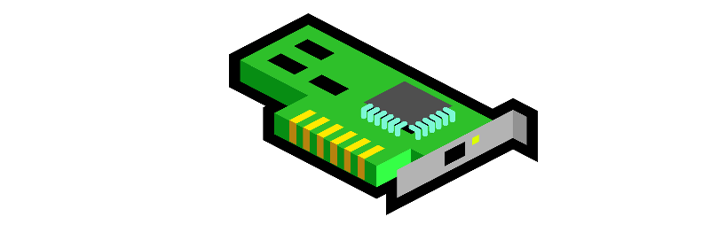
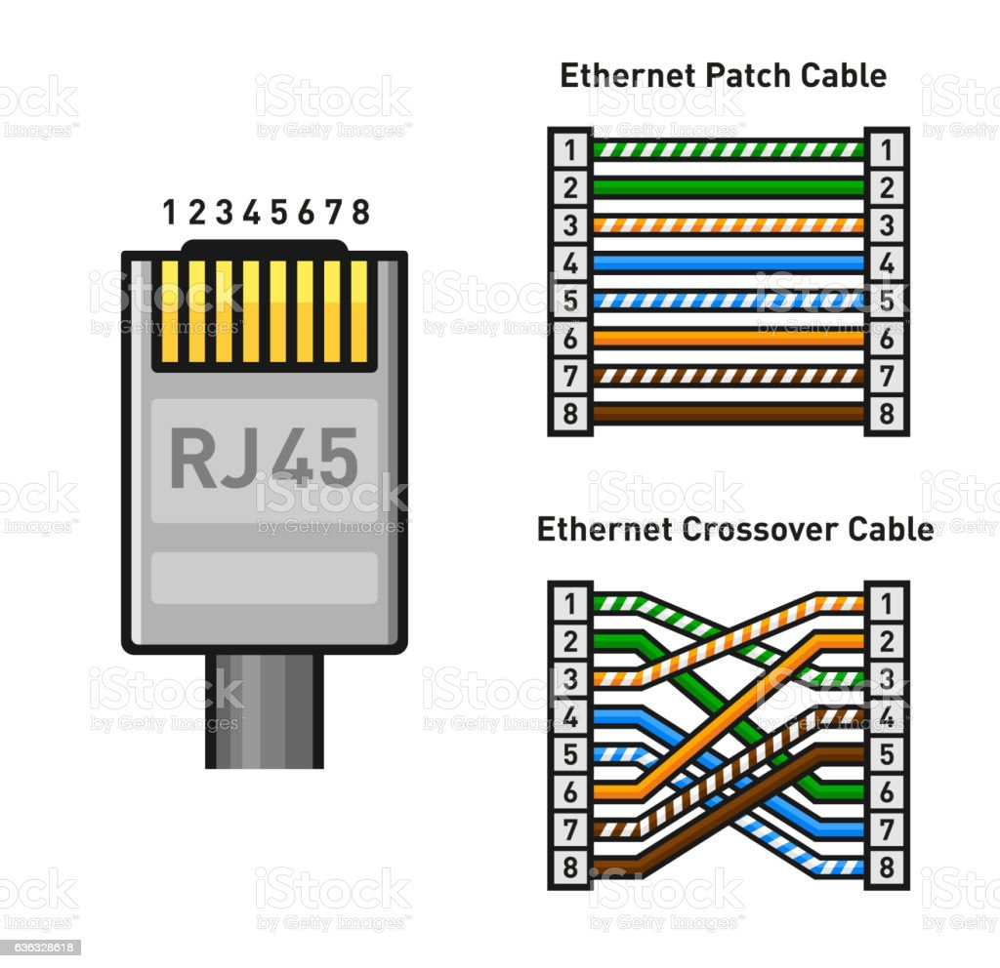
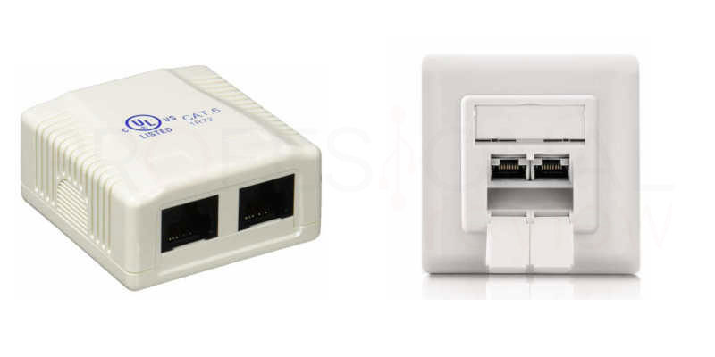

# 1.2. Tarjetas de interfaz de red (NIC)


Hecho por Antonio Montero Muñoz

Ultima modificación - 25/05/2022


Las tarjetas de red o Network interface controller (NIC) es un componente hardware que se conecta a un dispositivo informático y nos permite compartir recursos e información entre múltiples dispositivos.

Una tarjeta NIC consta de circuitos electrónicos necesarios para conectarse a un conjunto de ordenadores y puede ser de varios tipos. Cableada usando tecnologías como Token Ring, Fibra, Ethernet, etc. o inalámbrica como las Wi-Fi. Por tanto se trata de un dispositivo de capa física y enlace de datos ya que nos da acceso a la red y nos proporciona un sistema de direccionamiento por MAC.

### Historia de Ethernet

En 1970 el estudiante Robert Metcalfe graduado en MIT se encontraba estudiando un doctorado en la Universidad de Harvard fue a dormir a casa de Steve Crocker el cual le dejo dormir en el sofá, al no poder dormir Robert comenzó a leer una revista sobre la red ALOHA la cual estaba siendo creada por Norman Abramson. Robert se dio cuenta de que la red se podía mejorar de forma sustancial y tras escribió un articulo a Abramson además de convertir esa idea en su tesis doctoral describiendo el protocolo a seguir. El protocolo se basaba en que antes de comenzar a enviar datos se debería de comprobar si la red ya estaba siendo usada.

Metcalfe comenzó a trabajar en el centro de investigación de Xerox PARC donde se le encomendó la tarea de crear una red que conectara una serie de ordenadores de alto nivel con las primeras impresoras láser, la red debería tener una tasa de transferencia alta para el buen desempeño de las tareas por lo cual Metcalfe vio su oportunidad para poner en practica sus ideas.

Así fue en 1972 Metcalfe junto al recién doctorado David Boggs comenzaron a formar la red que constaba de cable coaxial y se le denomino "Alto Aloha Network" pero mas tarde a la vez que se iba mejorando de forma gradual conforme se iban creando nuevos prototipos se le cambio el nombre a Ethernet debido a una teoría física del momento. Finalmente se consiguió conectar la red uniendo 2 equipos entre si de forma exitosa.

## RJ45

### ¿Qué es?

El conector o puerto RJ45 es una interfaz de conexión utilizada principalmente para interconectar redes de intercambio de datos entre ordenadores y otros dispositivos. La roseta RJ45 es rectangular y con un elemento en forma de pestaña que hace las veces de seguro para que el cable no se salga de su interfaz.

Cuenta con un total de 8 pines, aunque no siempre son utilizados todos, ya que dependerá del uso del cable y de la velocidad de la red. A este puerto se conectará el cable de par trenzado conocido como UTP. Se comenzó a utilizar por primera vez en el año 1991, y fue diseñado por la EIA (Electronic Industries Alliance), de cuyo seno nació el estándar TIA/EIA-568-B, 568-A y 568-B1 que básicamente define el orden de conectores y colores en el conector.

Dependiendo de la protección que tiene frente a estímulos externos se distinguen numerosas categorías (4, 5, 5e, 6, 6a, 7, 7a y 8)

El uso más común de este cable son las redes bajo el estándar Ethernet, siendo una interfaz de tipo serie que es capaz de funcionar hasta los 10 Gbps actualmente, aunque hay implementaciones de 40 Gbps. Seguramente os suene es estándar 802.3, sobre el que se trabaja en la primera capa del modelo OSI: 10BASE-T (conexión a 10 Mbps), 100BASE-TX y 100BASE-T (conexión a 100 Mbps), 1000BASE-T (conexión a 1 Gbps) y 10GBASE-T (conexión a 10 Gbps). Existen otras normas o variantes para cables coaxiales, para cables de fibra óptica y otros tipos, pero nosotros solo nos centraremos en el RJ45 hoy.

El conector macho mide aproximadamente 2 cm de largo y casi siempre es de plástico transparente para visualizar el modo de conexión de sus cables, en modo directo o cruzado. En su extremo tiene unos conectores metálicos que previamente han atravesado cada conector para hacer contacto con su núcleo de cobre. Los cables de mayor categoría tienen estos conectores encapsulado de metal.

Antes de ver los tipos de cable RJ45 que tenemos, consideramos muy importante conocer el orden de los conductores del RJ45 y saber identificar los colores de estos conductores para saber qué transportan.

En este apartado debemos distinguir dos tipos de conexión llamadas cable cruzado y cable directo cuyas funciones son diferentes, así como la distribución de cables en el conector.

### Cable directo

El cable directo se utiliza para conectar para dos dispositivos que no son iguales, por ejemplo, nuestro ordenador con un router, Switch o hub. Hay dos formas de distribuir los cables en el conector, según la norma T568A y según la T568B. en cambios casos funcionará de forma idéntica, y lo más importante será que ambos extremos del cable serán exactamente iguales.

**T568A**

**T568B**

### Cable cruzado

Si lo que pretendemos es interconectar dos equipos iguales, por ejemplo, pos PC, necesitaremos un cable cruzado. Solo este nos puede dar una conexión de tipo full-dúplex y la posibilidad de enviar y recibir de forma simultánea en dos interfaces de red que a priori envían señales de salida.

En este caso lo que tendremos que hacer es utilizar en un extremo del cable la norma T568A y en el otro extremo la T568B tal que así:

Pero aún existe **otro modo** de conexión para que en este caso se **ajuste al estándar 1000BASE-T**:

### Tipos según categoría

* **Cat 5**: Es un cable de pares trenzados sin apantallamiento, utilizado en redes Fast Ethernet (100 Mbps) que soportarán transmisiones de hasta 100 MHz con poco ruido.
* **Cat 5e**: Pueden o no contar con apantallamiento y son capaces de trabajar en redes Gigabit ethernet a 1000 Mbps y transmitiendo a frecuencias de hasta 100 MHz definido en TIAEIA-568-B.
* **Cat 6**: Se utiliza para redes GbE aunque soporta frecuencias de 250 MHz, por tener apantallamiento y mayor resistencia al ruido externo.
* **Cat 6e**: Este cable entra dentro de la gama alta y es capaz de transportar hasta 10 Gigabits por segundo a frecuencias de hasta 500 MHz.
* **Cat 7**: Utilizados casi siempre para centros de datos y redes 10 GbE con baja tasas de pérdidas. Soporta frecuencias de 600 MHz y se define en la norma ISO-11801 teniendo un blindado conjunto e individual para cada par trenzado.
* **Cat 7e**: Capaces de transmitir a una frecuencia de 1000 MHz y velocidades de hasta 10 o 40 Gbps si son de buena calidad.
* **Cat 8**: La máxima protección interior y también exterior e incluso en el conector de estos cables nos brindan velocidades Ethernet a 40 Gbps y frecuencias de 2000 MHz.

### Tipos según construcción

* **UTP**: Será un cable trenzado sin blindaje, por lo que todas las parejas tranzadas coexisten en la misma cobertura de plástico sin ningún elemento que las aísle. Estos cables pertenecen a las categorías 5 y 5e normalmente.
* **FTP**: Para la construcción de este cable se ha utilizado un apantallado exterior que rodea todos los pares de cables a la vez, que será normalmente de aluminio y plástico. A su vez cada par trenzado estará o no separado de los demás con una cobertura de plástico además del propio conductor. Estos cables pertenecen a las categorías 5e y 6.
* **STP**: Ahora tenemos cables que pertenecen a las categorías 6 o 6e. En este caso tenemos un blindado individual en cada par trenzado para aislarlos de sus compañeros.
* **SFTP**: Basándose en el cable FTP, pero con una malla metálica LSZH que a su vez recubre el apantallamiento global. Esta lámina hace la misma función que la de un cable coaxial, conectarse a tierra para descargar las interferencias electromagnéticas del exterior y de los propios pares. Estos cables pertenecen a categorías 6 o superiores.
* **SSTP**: En este caso hablamos de cables de muy alta calidad y pertenecientes a categorías superiores a la 6 en todos los casos. Estos cuentan con blindado individual de aluminio en cada par trenzado y además apantallado exterior de aluminio incluso con trenzado metálico LSZH para dotarlo de mayor rigidez y conexión a tierra.

## SFP+

### ¿Qué es?

SFP+ (small form-factor pluggable plus); en español: pequeño factor de forma enchufable plus es una versión mejorada del SFP. Es compatible con Fibre Channel de 8 Gbit/s, 10 Gigabit Ethernet y con el estándar OTU2 de la red de transporte óptico. El módulo SFP+ incorpora también el acoplamiento directo para enlazar dos puertos SFP+ sin transceptores de fibra adicionales, incluyendo DAC (cable de acoplamiento directo) y AOC (cable óptico activo).

### Beneficios

* Proporcionan una alta fiabilidad de sistema basado en la calificación rigurosa y las pruebas de certificación.
* Aprovechan los parámetros de diseño único para proporcionar el máximo rendimiento de los equipos de alta gama en el mercado, garantizando la continuidad del negocio de las empresas.
* Ayuda a eliminar los problemas relacionados con la incompatibilidad de los transceptores ópticos genéricos, reduciendo tiempo de inactividad y los costes de soporte.
* Optimiza la conectividad con las plataformas permitiendo utilizar la distancia máxima del cable de fibra óptica.

## SFP+ RJ45

El módulo SFP+ RJ45 es el primer módulo SFP+ RJ45 10G que proporciona una comunicación de 10Gb/s a través del cable Ethernet, cumpliendo con los estándares SFF-8431 y SFF-8432 MSA. Es compatible con el cableado estructurado Cat6a o Cat7, tiene una distancia de transmisión de 100m.

### Características del SFP+ RJ45

* Factor de forma más pequeño: interoperable con conector SFP+.
* Rendimiento: una demostración PHY completa, lo que significa que no se perderá nada.
* Innovación: conectable en caliente a través de un arranque suave administrable.
* Auto-negociable y retro-compatible: Es compatible con las redes anteriores de 10/100/1000BASE-T, permitiendo una migración a los 10GbE sin problemas.
* Costo: Debido al alto precio de cobre, el precio de SFP+ RJ45 es un poco alto en comparación con SFP+ fibra.

### Aplicación de módulo SFP+ RJ45

Los transceptores SFP+ RJ45 pueden aplicarse en arquitecturas Top of Rack, Middle of Row o End of Row en centros de datos y redes empresariales. Las siguientes imágenes ilustran dos aplicaciones con módulos SFP+ RJ45.Escenario uno: conección el servidores y/o dispositivos de almacenamiento con 10GBASE-T RJ-45 a un switch de red SFP+.

