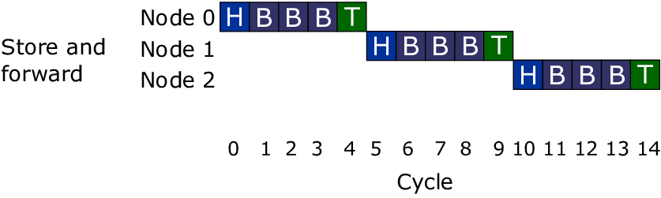
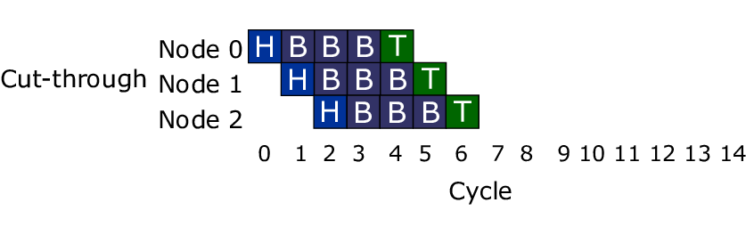

# 1.7. Conmutadores

## Introducción

Los conmutadores poseen la capacidad de aprender y almacenar las direcciones de capa de enlace de datos o capa 2 del modelo OSI de los dispositivos alcanzables a través de cada uno de sus puertos. Por ejemplo, un equipo conectado directamente a un puerto de un conmutador provoca que el conmutador almacene su dirección MAC.

Esto les permite enviar los paquetes de datos desde el puerto de origen hacia el puerto destino, es decir, direccionar el paquete correctamente. Básicamente, cuando un equipo envía un mensaje, el switch lo captura y envía solo por el puerto del equipo destinatario del mensaje.

### Métodos de direccionamiento de tramas.

#### _**Store-and-Forward**_

Estos switches guardan en memoria todo el paquete de datos y lo analizan. Luego, se hace una verificación por redundancia cíclica CRC **** y una medición del tamaño del paquete. Si estas comprobaciones fallan el paquete es descartado, de lo contrario se envía al destinatario. Este método asegura la transmisión sin errores, pero puede generar latencia en la comunicación.

Este método asegura operaciones sin error y aumenta la confianza de la red. Pero el tiempo utilizado para guardar y chequear cada trama añade un tiempo de demora importante al procesamiento de las mismas. La demora o delay total es proporcional al tamaño de las tramas: cuanto mayor es la trama, más tiempo toma este proceso.

#### _**Cut-Through**_

Este método fue creado para eliminar la latencia generada en el método de almacenamiento y envío. En este tipo de conmutación sólo se obtiene la dirección del destinatario y el paquete se envía. Como consecuencia, se pueden enviar paquetes con errores generados por colisiones saturando el ancho de banda.&#x20;

El problema de este tipo de switch es que no detecta tramas corruptas causadas por colisiones (conocidos como _runts_), ni errores de CRC. Cuanto mayor sea el número de colisiones en la red, mayor será el ancho de banda que consume al encaminar tramas corruptas.

Existe un segundo tipo de switch cut-through, los denominados _**fragment free**_, fue proyectado para eliminar este problema. El switch siempre lee los primeros 64 bytes de cada trama, asegurando que tenga por lo menos el tamaño mínimo, y evitando el encaminamiento de runts por la red.

#### _**Adaptive Cut-Through**_

Este tipo de switch pose los dos métodos de conmutación, pudiendo ser configurados para usar uno o el otro. Además, los switch pueden usar los dos modos simultáneamente, donde el mismo decide qué modo emplear en cada momento. Si se generan muchas tramas con error el switch puede cambiar a modo de almacenamiento y reenvío hasta que la red se estabilice.

### Capas en las que trabajan.

#### **CONMUTADOR DE RED O SWITCH CAPA 2.** 

Actúan como puentes multi-puertos dentro de una LAN y dividen a la misma en subredes. Estos switch deciden el destino de los paquetes de datos según la dirección MAC de destino contenida en el paquete. Esto conmutadores posibilitan transmitir datos simultáneamente sin causar interferencias en otras sub-redes.

Su principal limitación es que no permiten filtrar difusiones de datos o broadcast. Además, nunca se podrá enviar un paquete cuya dirección MAC de destino no se encuentre almacenada en la tabla de direcciones del conmutador.

